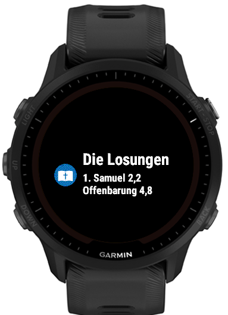
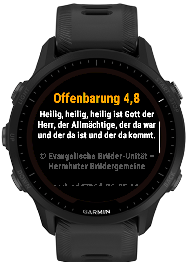

# Die Losungen

## Copyright und Nutzungsbedingungen der Losungstexte

Die Losungen der Herrnhuter Brüdergemeine sind urheberrechtlich geschützt.

© Evangelische Brüder-Unität – Herrnhuter Brüdergemeine
([www.herrnhuter.de](https://www.herrnhuter.de))

Weitere Informationen finden Sie [hier](https://www.losungen.de).

Die Bibeltexte stammen aus der Lutherbibel und sind © Deutsche
Bibelgesellschaft, Stuttgart.

Die Verwendung der Losungstexte in diesem Projekt erfolgt mit Genehmigung der
Brüder-Unität und unterliegt den Bedingungen in
[`NUTZUNGSBEDINGUNGEN_Losungen_2023-11.pdf`](NUTZUNGSBEDINGUNGEN_Losungen_2023-11.pdf).

Dieses Projekt ist nicht offiziell von der Brüder-Unität oder von Garmin.

---

Connect-IQ-Watch-App für Garmin-Sportuhren, die täglich Losung
(alttestamentlicher Vers) und Lehrtext (neutestamentlicher Vers) der
Herrnhuter Losungen anzeigt. Die Daten 2026 sind als App-Ressource
eingebettet — die Uhr braucht keine Internetverbindung.

## Funktionen

- **Glance ("Übersicht")**: Datum, Bibelstellen und Textanfang.
- **App**: Volltext-Ansicht von Losung und Lehrtext mit Scrollen via
  Hoch/Runter oder Touch.

## Screenshots

| Glance | Losung (AT) | Lehrtext (NT) |
| --- | --- | --- |
|  |  |  |

## Unterstützte Geräte

Forerunner 955; fēnix 7 / 7S / 7X (inkl. Pro und Pro nowifi); fēnix 8
(43/47 mm, Pro 47 mm, Solar 47/51 mm); fēnix E; epix Pro Gen 2
(42/47/51 mm); venu 3 / 3S; venu 4 (41/45 mm); vívoactive 5 / 6;
Instinct 3 AMOLED (45/50 mm).

Die maßgebliche Liste steht in [`garmin/manifest.xml`](garmin/manifest.xml).

## Lokal bauen und im Simulator starten

Voraussetzungen:
- [Connect IQ SDK](https://developer.garmin.com/connect-iq/sdk/) (>= 9.1)
  mit den gewünschten Device-Packs (über den SDK Manager installieren)
- Java 17+
- Ein lokaler Developer-Key (`developer_key.der`); erzeugbar via
  `monkeybrains → Generate a Developer Key`.

```sh
./run-sim.sh              # baut für fr955 und startet den Simulator
./run-sim.sh fenix7       # für ein anderes Gerät
```

Details zum Aufbau des Garmin-Teils: [`garmin/README.md`](garmin/README.md).

## Lizenz

Der Code dieses Projekts steht unter der MIT-Lizenz — siehe
[`LICENSE`](LICENSE). Die MIT-Lizenz gilt **ausschließlich für den
Code**; die Losungs- und Bibeltexte unterliegen den oben genannten
Copyrights und Nutzungsbedingungen.
